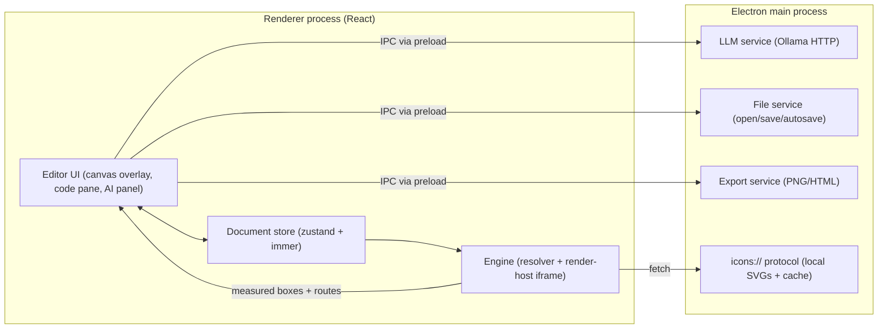

# PLAN.md — Diagrammer: a local-first AI diagram editor

> Working title "Diagrammer" (rename freely). This file is both the spec and the build plan.
> It is written for Claude Code to execute phase by phase.

---

## 0. How to work on this project (instructions for Claude Code)

- Work **one phase at a time, in order**. Phase 6 (training) may start in parallel once Phase 1 passes.
  Don't start a phase until the previous phase's acceptance criteria pass.
- Before writing code that touches rendering, read §5 and the upstream source files it points to.
  Clone upstream into `vendor-ref/eraser-diagrams` (gitignored, read-only reference):
  `git clone https://github.com/eraserlabs/eraser-diagrams vendor-ref/eraser-diagrams`
- Tick the checkboxes in this file as tasks complete.
- Record every spike result, and any deviation from §2, in `DECISIONS.md` (date, decision, reason, numbers).
  **Ask the user before changing a decision marked `locked`.**
- Keep `pnpm check` (typecheck + lint + test) green at the end of every task.
- One task ≈ one small, reviewable commit.
- When something in this plan turns out to be wrong about the upstream library, trust the upstream source,
  note the correction in `DECISIONS.md`, and update this file.

---

## 1. Goal and scope

Build a desktop diagram editor, in the spirit of eraser.io's diagram-as-code + AI, that:

1. Uses the open-source **Eraser Diagrams** format and renderer (MIT, `@eraserlabs/*` v0.2.0) as the
   **single diagram model**, for manual editing and for AI generation.
2. Generates and edits diagrams with **locally hosted LLMs** (Ollama first), with no usage limits.
3. Later ships a **small model fine-tuned** on the Eraser Diagrams format.

**MVP (Phases 0–5):** one diagram per file; canvas + JSON code pane + AI panel; offline icons;
PNG / HTML / JSON export; installable desktop builds.

**Non-goals for MVP:** real-time collaboration, cloud sync, freeform whiteboard, docs pane,
web version, mobile. See §10.

---

## 2. Key decisions

| #   | Decision | Why | Status |
| --- | --- | --- | --- |
| D1  | The Eraser Diagrams JSON document (split form `{ entities, connections }`) is the **only** diagram model. No React Flow, no Mermaid. | One model shared by AI, code pane and canvas. Icons by name, groups and containment built in. | locked |
| D2  | **Electron** desktop app. Renderer UI in **React + Vite + TypeScript**. Not Next.js, not Tauri. | The render bundle needs Chromium, and Electron ships it, so text measurement is identical on every machine. Next.js server routes have no natural home in Electron. Tauri uses WebKit on macOS/Linux. | locked |
| D3  | Rendering runs **in the renderer process**: `@eraserlabs/resolve` plus the `@eraserlabs/render` IIFE inside a dedicated iframe. The Playwright-based Node API (`@eraserlabs/diagrams`) is used only by training/eval scripts. | No second browser inside the app; enables live editing. | locked |
| D4  | Local LLM via the **Ollama HTTP API, called from the main process** (no CORS). Optional `node-llama-cpp` backend later to bundle a model. | Simplest path to any local model. | locked |
| D5  | Pin every `@eraserlabs/*` package to exact `0.2.0`. Upgrades are explicit tasks. | Library is weeks old and closed to outside contributions. | locked |
| D6  | pnpm workspaces monorepo; `electron-vite` for the desktop build; Vitest for unit tests; Playwright (`_electron`) for e2e. | Standard, well-supported tooling. | proposed |
| D7  | Editor state: zustand + immer patches (patches power undo/redo). | Small, predictable, easy undo. | proposed |
| D8  | Code pane: CodeMirror 6, JSON language, lint diagnostics mapped from resolver JSON Pointer paths. | Lightweight and extensible. | proposed |
| D9  | Layout fallback: `elkjs` (layered, hierarchical), used only when generated output overlaps or the user clicks Auto-layout. | Small models are weak at coordinates. | proposed |
| D10 | Fine-tuning lives in a separate workspace, `training/` (Python via `uv` + Node scripts). | Keeps ML tooling out of the app. | proposed |

---

## 3. Architecture



**Render flow:** document → `resolver.resolve(doc)` → `__eraser.run({ entities, connections, icons })`
inside the render-host iframe → `{ measures, layout }` → the editor builds interaction hit-boxes from the
measured boxes. Measured JSON comes from the ported `toDiagramJson` (§5.3).

**Generate flow:** prompt → main-process LLM service → JSON → `resolver.validate` → repair loop (≤ 2) →
icon fix-up → render → overlap check → ELK fallback if needed → commit to the store as one undo step.

**Drag flow:** decided by spike S1 (Phase 1). Candidates: full `run()` per frame; DOM transform plus partial
re-route with `@eraserlabs/layout`; or ghost-only drag with a full `run()` on drop.

**Security:** `contextIsolation: true`, `nodeIntegration: false`, `sandbox: true`, typed preload API only.
LLM output is treated as untrusted data. It only ever reaches the DOM through the resolver, which validates
and sanitizes it; upstream component templates cannot execute code.

---

## 4. Repository layout

```
diagrammer/
  PLAN.md  DECISIONS.md  CLAUDE.md
  package.json  pnpm-workspace.yaml  tsconfig.base.json
  apps/
    desktop/          Electron (electron-vite): src/main, src/preload, src/renderer
  packages/
    engine/           resolver setup, render-host iframe, fonts, measured JSON, icon loader,
                      default stripping, overlap checks, ELK fallback
    editor/           React editor: canvas overlay, code pane, inspector, palette, AI panel
    ai/               prompt assembly, schemas, repair loop, icon alias resolution (pure TS;
                      shared by the app and by training/eval)
    shared/           shared types + IPC contracts (zod)
  icons/              local SVG catalog + aliases.json (see §11 before committing third-party icons)
  training/           dataset, fine-tune, export and eval scripts (§8)
  vendor-ref/         gitignored clone of eraser-diagrams for reference
```

---

## 5. Eraser Diagrams integration notes (verified against upstream v0.2.0)

### 5.1 Packages

All are published on npm at `0.2.0`:

| Package | Use in this project |
| --- | --- |
| `@eraserlabs/resolve` | Validate and resolve documents (browser-safe). |
| `@eraserlabs/diagram-templates` | Stock component library (`stockLibrary`), `buildRenderPageSetup`, and `/normalizers` (`stockNormalizers`). The folder upstream is `packages/templates`, but the npm name is `diagram-templates`. |
| `@eraserlabs/render` | In-page render bundle (`/browser/iife`); `buildHtmlDocument` (root export, Node-safe). |
| `@eraserlabs/layout` | Connection router with partial routing (`LayoutManager`, `routeCorridorConnectionBatch`). |
| `@eraserlabs/protocol` | Base document JSON Schema (`/schemas/document`) and contracts. |
| `@eraserlabs/diagrams` | Node API (Playwright + Chromium). **Training/eval scripts only.** Also the source of the vendored fonts. |

### 5.2 Document format essentials

Source: upstream `GETTING_STARTED.md`; per-tag schemas live in `packages/templates/src/templates/*/*.schema.ts`.

- **Envelope.** The split form needs both `entities` and `connections` (an empty array is fine). The only
  other accepted form is `{ elements }`. A bare array is rejected (`E_ENVELOPE`).
- **Entities.** Every entity needs `tag`, `id`, `x` and `y` (non-negative integers, top-left origin).
  `width`/`height` are minimums; real sizes are measured. The resolver rounds coordinates to integers.
- **Stock entity tags:** `Shape`, `Icon`, `Activity`, `Event`, `Gateway`, `Textbox`, `Group`, `Lane`,
  `Pool`, `Divider`, `DatabaseTable`, `Legend`.
- **Connection tags:** `Relationship` (the default when untagged; `endArrowhead` defaults to `triangle`)
  and `DatabaseRelationship`.
- **Containment** uses `containerId`. `Group`, `Lane` and `Pool` carry their text in a `title` object.
- **No app metadata in the document.** Unknown top-level keys produce a `W_UNKNOWN_KEY` warning (`title`
  is accepted and ignored by rendering), so keep app metadata in app storage, keyed by file path.
- **Issues** carry a stable `code`, a JSON Pointer `path` and the element index and tag
  (e.g. `W_UNKNOWN_ICON`, `E_KIND_MISMATCH`). Use them for code-pane diagnostics and the AI repair loop.
- **No entity placement.** The library places nothing: positions come from the model, the user, or the
  ELK fallback. It only routes connections.

### 5.3 Engine bootstrap

Mirror upstream `packages/diagrams/src/diagrams.ts` (`createRenderer`, roughly lines 270–400), but drive
an iframe instead of Playwright.

1. **Create the resolver.** `createResolver({ library: stockLibrary, normalizers: stockNormalizers, iconLoader, onUnknownIcon: 'placeholder' })`.
   Imports come from `@eraserlabs/resolve`, `@eraserlabs/diagram-templates` and
   `@eraserlabs/diagram-templates/normalizers`. The resolver runs in browsers (the upstream playground
   does this).
2. **Build the page setup** with `buildRenderPageSetup(resolver.library)` from `@eraserlabs/diagram-templates`.
3. **Create the render host,** a same-origin iframe:
   - Its document must be **standards mode** (`<!doctype html>`). Quirks mode breaks sizing; see the
     upstream comment in `preparePage`.
   - It loads the IIFE `@eraserlabs/render/browser/iife` (`dist/browser/eraser-render.iife.js`).
   - The bundle appends `#eraser-scene` to `document.body`, which is why it needs its own document.
4. **Run setup once,** in this order:
   - `window.__eraser.setup(pageSetup)`
   - `await window.__eraser.registerFonts({ css, faces })`. The payload shape is in
     `packages/diagrams/src/fonts/inject.ts`.
   - Fonts are vendored in `@eraserlabs/diagrams` under `fonts/`: Inter, JetBrains Mono and Shantell Sans,
     all SIL OFL 1.1. Copy them into app resources with their license files.
   - Never fall back to system fonts, because metrics drive layout.
5. **Per render:**
   - `const r = await resolver.resolve(doc)`
   - If `r.ok`: `await __eraser.run({ entities: r.entities, connections: r.connections, icons: r.icons })`
     returns `{ measures, layout }`.
6. **Measured JSON.** Upstream `toDiagramJson(authored, layout)` in `diagrams.ts` is **not exported**.
   Port it into `packages/engine`, keeping the MIT notice in a header comment.
7. **HTML export:** `__eraser.serialize()` → `{ scene, css }`, then `buildHtmlDocument` from `@eraserlabs/render`.
8. **PNG export:** the main process renders the document in a hidden BrowserWindow with the same engine,
   then calls `webContents.capturePage(<rect of #eraser-scene>)`.

### 5.4 Icons

- The upstream default loader fetches
  `https://storage.googleapis.com/eraser-public-assets/canvas-icons/<name>.svg`
  (see `packages/diagrams/src/icons/eraserLoader.ts`).
- **Our loader**, an `icons://<name>.svg` custom protocol in the main process, tries in order:
  1. the user icon dir;
  2. the app `icons/` catalog;
  3. optional hosted fallback, behind a setting and cached in `userData`.
- Unknown names render a placeholder and produce a warning.
- Eraser's catalog names (`aws-lambda`, `postgres`, `server`, `node`, `react`, `docker`, `kubernetes`,
  `redis`, `user`, `globe`, …) are the canonical naming scheme for our catalog.

### 5.5 Layout and routing

- `@eraserlabs/layout` provides `LayoutManager` + `routeCorridorConnectionBatch({ layoutManager, connectionsToRoute, options })`.
- Connections not listed in `connectionsToRoute` stay fixed (partial routing).
- Options include `pinUnaffectedRoutes`, `preservePorts`, `repair` and `labels`.
- Use it for live drag if spike S1 picks that strategy.

### 5.6 Schemas and defaults

- `@eraserlabs/protocol/schemas/document` defines the base envelope.
- `resolver.tagSchema(tag)` and `resolver.registryInfo()` give per-tag schemas, including defaults
  (e.g. Relationship `endArrowhead: 'triangle'`, `cornerStyle: 'elbow'`).
- Derive the default-stripping utility (§7.1) from these schemas rather than hard-coding defaults.

### 5.7 Reference fixtures

- 24 diagrams in `fixtures/corpus` and 11 in `fixtures/features`.
- Goldens are in `fixtures/__goldens__/<group>/*-darwin.{png,json}` and were generated on macOS.

---

## 6. App spec (MVP)

**Layout:** code pane on the left (collapsible), canvas in the center, AI panel on the right (collapsible),
toolbar on top, status bar at the bottom (diagnostics count, render time).

### Canvas

- **Display:** the render-host iframe, zoomed via CSS transform. Pan with space-drag or the trackpad; zoom
  with ctrl/cmd + wheel; fit-to-screen.
- **Interaction overlay** (React, above the iframe), built from measured boxes:
  - hover, select, shift-click multi-select, marquee select
  - move, resize (writes `width`/`height` minimums), delete, duplicate, arrow-key nudge
- **Containment:** dragging into or out of a `Group`/`Lane`/`Pool` updates `containerId`.
- **Connections:** drag from a handle on the selected entity to another entity to create one; connections
  can also be selected and deleted.
- **Inline text editing** on double-click: first text run, group title, or textbox text.
- **Inspector**, generated from the tag schema: color token or CSS color, shape, icon, size, styleMode,
  arrowheads, line style, label.
- **Icon picker:** a searchable grid of the local catalog plus user icons.
- **Add-element palette** (Shape, Icon, Group, Textbox, DatabaseTable, …). New elements are inserted at the
  viewport center.

### Code pane

- Shows the document as formatted JSON.
- Edits are debounced (300 ms), then parsed and run through `resolver.validate`. Issues appear as CodeMirror
  lint markers at their JSON Pointer paths.
- The canvas updates only from valid documents; the last good render stays visible.
- Canvas edits rewrite the code pane and preserve the cursor where possible.

### Documents and files

- **Format:** `.json` containing exactly the Eraser Diagrams document (optional `title`).
- Open, save, save-as, recent files, autosave (2 s idle, to a recovery file), dirty indicator, confirm on close.
- Undo/redo covers canvas, code and AI edits. Each AI result is one undo step.
- Per-file app metadata (pinned entity ids, viewport) lives in `userData`, keyed by path.

### Export

PNG (1x/2x, optional transparent background), standalone HTML, measured JSON, copy PNG to clipboard.

### AI panel

- **Modes:** Generate (new diagram) and Edit (modify the current one).
- **Controls:** prompt box, model dropdown (from Ollama `/api/tags`), Stop button, and progress states
  (generating → validating → repairing n/2 → rendering → layout fallback).
- Shows the resulting warnings and a one-click "Undo AI change".
- "Allow AI to move existing elements" checkbox. Off by default; see §7.8.
- **Settings:**
  - Ollama base URL (default `http://127.0.0.1:11434`)
  - model
  - temperature (default 0.2)
  - max repair attempts (default 2)
  - context size
  - allow hosted icon fallback
- If Ollama is unreachable, show an actionable message with how to start it.

---

## 7. AI pipeline spec (`packages/ai`)

### 7.1 Output contract

The model returns exactly one JSON object in split form. Use compact style: omit properties equal to
tag-schema defaults, and omit connection `tag`/`id`. The same default-stripping utility normalizes the
few-shot examples and the training data.

### 7.2 Prompt assembly

The **system prompt** contains:

- **Format rules:**
  - ids unique and kebab-case
  - integer coordinates
  - containers listed before their children
  - children inside their container's bounds
  - at least ~40 px between siblings
  - left-to-right or top-to-bottom primary flow
- A **compact tag cheat sheet** generated from the tag schemas (common properties only).
- An **icon vocabulary subset.** Pick it by provider keywords (aws / gcp / azure / k8s); otherwise use a
  general tech list. Cap it at ~300 names.
- **2–3 few-shot examples,** chosen by diagram type from a curated set seeded from upstream fixtures
  (defaults stripped).

In **Edit mode,** also include the current document (stripped, minified), the pinned ids and the
instruction, and ask for the complete updated document.

### 7.3 Constrained decoding (spike S3)

Call Ollama `/api/chat` with `format` set to a JSON Schema. Compare:

- (a) envelope + `oneOf` over all stock tag schemas
- (b) envelope + a loose entity schema
- (c) `format: "json"`

Pick the strictest option with acceptable latency and record the numbers in `DECISIONS.md`.

### 7.4 Repair loop

1. Run `resolver.validate(doc)`.
2. On errors, send a follow-up turn with at most 10 issues formatted as `code path message`, plus
   "return the full corrected document".
3. Stop after 2 attempts.
4. If it still fails, show the best attempt as a draft in the code pane with its diagnostics, and don't
   commit it.

### 7.5 Icon fix-up

For each `W_UNKNOWN_ICON`, try in order:

1. exact match
2. `icons/aliases.json`
3. Fuse.js fuzzy match (tune the threshold)

If nothing matches, keep the placeholder. Apply fix-ups before rendering and report them in the panel.

### 7.6 Layout quality check

From the measured boxes, count:

- overlaps between siblings (same `containerId`)
- children outside their container's body

If any are found on a fresh generation, apply the ELK fallback.

### 7.7 ELK fallback and Auto-layout

- **Graph:** a hierarchical elk graph from entities (nested by `containerId`, measured sizes, extra top
  padding for container titles), with connections as edges.
- **Options:** `elk.algorithm: layered`, `elk.hierarchyHandling: INCLUDE_CHILDREN`.
- **Write-back:** convert ELK's parent-relative coordinates to absolute integer `x`/`y`, then re-render.
- **Toolbar "Auto-layout" button:** runs the same thing on the whole diagram as one undo step (like
  Eraser's "reset layout").

### 7.8 Position merge in Edit mode

By default, entities whose ids existed before the edit keep their previous `x`/`y`. Only new entities take
the model's coordinates. If a new entity overlaps, nudge it to the nearest free slot next to its first
connected neighbor. The "Allow AI to move existing elements" checkbox disables the merge.

---

## 8. Fine-tuning workspace (`training/`)

**Goal:** a 3–8B model that beats the best base model + few-shot on the eval metrics below, served
through Ollama as `diagrammer-ft`.

**Tooling:**

- Python 3.11+ via `uv`.
- Node scripts for anything that renders. They reuse `packages/engine` / `packages/ai` and the
  `@eraserlabs/diagrams` Node API with a local Chrome (`chromiumPath`).

**Pipeline.** Each step is an idempotent script that writes JSONL to `training/data/<step>/`.

1. **seeds**
   - Import upstream `fixtures/corpus` + `fixtures/features`.
   - Skip the intentional error/warning fixtures (`errors-unknown-tag`, `warnings-only`).
   - Convert `{ elements }` documents to split form and strip defaults.
   - Output: the curated few-shot set and the seed set.
2. **prompts.** Synthesize diverse user prompts across these types:
   - cloud architecture (AWS / GCP / Azure / Kubernetes) and generic system architecture
   - flowcharts and data-flow diagrams
   - ERDs (`DatabaseTable` / `DatabaseRelationship`)
   - BPMN swimlanes (`Pool` / `Lane` / `Activity` / `Event` / `Gateway`)
   - org charts and user journeys

   Vary length, detail and phrasing. Include code and IaC as prompts: Terraform, SQL DDL, docker-compose,
   k8s manifests.
3. **teacher**
   - Generate documents with an **open-weight teacher model whose license permits training other models
     on its outputs.** Verify this before running, and record the model and license in
     `training/TEACHER.md`.
   - Prompt it few-shot with the seeds, and take 2 samples per prompt for best-of-N.
4. **edits.** Build edit pairs `(doc, instruction) → doc'` from accepted documents in two ways:
   - teacher-written edits: add, remove, rename, regroup, restyle;
   - programmatic edits with exact targets: rename, recolor, add node, change icon.
5. **verify.** Render every candidate with `outputs: { json: true }`.
   - Reject any candidate with an error, any `W_UNKNOWN_ICON`, sibling overlaps, children outside their
     containers, or duplicate ids.
   - Keep the best of N, preferring fewest warnings, then most compact.
   - Save PNGs for a random 5% into a contact sheet for manual spot-checks.
6. **dedupe + split**
   - Remove near-duplicates by prompt embedding.
   - Split into train / val / test, with 100 held-out test prompts stratified by diagram type.
7. **format**
   - Write chat-format JSONL (system, user, assistant) using the app's system prompt (a shorter variant is
     allowed).
   - The assistant turn is minified, default-stripped JSON.
   - Report token-length stats and set max sequence length to p99.
8. **train.** LoRA / QLoRA, with the loss on assistant tokens only:
   - **CUDA:** Unsloth + TRL SFT. **Apple Silicon:** MLX-LM LoRA.
   - **Start with:** r=16, alpha=32, lr 2e-4, 2–3 epochs.
   - **Base model:** the best of 2–3 candidate 3–8B instruct/coder models from the Phase 3 baseline eval.
9. **export**
   - Merge the adapter and convert to GGUF (Q4_K_M and Q8_0).
   - Write a Modelfile with the chat template, the system prompt and `temperature 0.2`.
   - Run `ollama create diagrammer-ft`.
10. **eval.** Run the test prompts through the exact app pipeline (`packages/ai`), with repair on and off,
    comparing base + few-shot against the fine-tuned model.
    - **Metrics:**
      - first-try valid %
      - valid after repair %
      - render success %
      - unknown-icon rate
      - overlap rate
      - mean latency
      - output tokens
    - Optionally score prompt faithfulness manually or with an LLM judge on 30 samples.
    - Write the report to `training/reports/<date>.md`.

**Data targets before the first training run:** ≥ 2,000 verified generation pairs and ≥ 1,000 edit pairs.

**Success criteria:** the fine-tuned model reaches first-try valid ≥ 95%, and its overlap rate is below
base + few-shot.

---

## 9. Phases and acceptance criteria

### Phase 0 — Scaffold

- [x] pnpm monorepo per §4; TypeScript strict; Biome (or ESLint + Prettier); Vitest; `pnpm check` script. _(single package, not a monorepo — see DECISIONS.md)_
- [x] `apps/desktop` with electron-vite: main, preload (contextBridge; security flags per §3), React renderer.
- [x] Typed IPC contracts in `packages/shared`, validated with zod on both sides.
- [x] Install `@eraserlabs/*@0.2.0` with exact versions; clone upstream into `vendor-ref/` (gitignored).
- [x] Write `CLAUDE.md`: commands, conventions, pointers to this file and §5. Create `DECISIONS.md`.

**Acceptance:** `pnpm dev` opens a window; `pnpm check` passes.

### Phase 1 — Engine spike (highest risk, do first)

- [x] `packages/engine` exposes `render(doc)` → `{ measures, layout, measuredJson, warnings, errors, timings }`.
  It covers resolver setup, the render-host iframe and font registration.
- [x] Port `toDiagramJson` (with the MIT notice).
- [x] `icons://` protocol with the hosted fallback enabled (dev only for now).
- [ ] Dev screen: a fixture picker that renders every upstream fixture.
- [x] Golden test on macOS: for every corpus fixture, measured boxes match `__goldens__/*-darwin.json`
  within ±2 px. Tune the tolerance if Electron's Chromium differs, and document it. On other OSes, render
  without errors.
- [x] Benchmark render time for small (~10 nodes), medium (~40) and large (100+) diagrams; record in
  `DECISIONS.md`.
- [x] **Spike S1 (drag strategy):** compare
  - (A) full `run()` per frame
  - (B) DOM transform + partial re-route via `@eraserlabs/layout` + path redraw
  - (C) ghost-only drag with `run()` on drop

  Pick by measured latency.
- [x] **Spike S2:** PNG export from a hidden BrowserWindow via `capturePage` at 2x. _(done with CDP `Page.captureScreenshot`, as Playwright does)_

**Acceptance:** all fixtures render; the golden test passes on macOS; S1 and S2 are decided and recorded.

### Phase 2 — Editor core

- [x] Document store with immer patches; undo/redo. _(whole-document snapshots — see DECISIONS.md)_
- [x] Canvas:
  - pan/zoom, overlay hit-boxes
  - select, multi-select, marquee
  - move, resize, delete, duplicate, nudge
  - `containerId` reparenting
- [x] Connection creation via drag handle; select and delete connections.
- [x] Inline text editing; schema-driven inspector; add-element palette.
- [x] Code pane with two-way sync and JSON-Pointer diagnostics.
- [ ] File open, save, save-as, recent files, autosave and recovery; dirty state; per-file metadata store.

**Acceptance:**

- A 15-node AWS-style diagram can be built by hand without touching JSON.
- Save → open round-trips with identical document content.
- An e2e test covers create → connect → save → reopen.

### Phase 3 — AI via Ollama

- [x] Main-process LLM service: list models, streaming chat, cancel, timeouts, actionable errors.
- [x] `packages/ai`: default stripping, prompt assembly, few-shot set, provider-filtered icon list,
  repair loop. Unit tests use recorded model outputs.
- [x] Spike S3 (constrained decoding); record the decision.
- [x] AI panel per §6, including the Edit-mode position merge (§7.8).
- [ ] Baseline eval script, shared with `training/`: 30 prompts × 2–3 local models; write a report.

**Acceptance:** this prompt on the default model yields a valid, rendered, overlap-free diagram with correct
icons in ≥ 8/10 runs:

> "AWS serverless API: API Gateway, Lambda, DynamoDB and S3 inside a VPC"

### Phase 4 — Icons

- [ ] Catalog build script: ingest SVG packs into `icons/<name>.svg`, normalizing names to Eraser-style
  kebab-case (`aws-lambda`, `postgres`, …), plus `aliases.json`.
- [ ] Custom user icons: import SVG → sanitize → user icon dir → available in the picker and the AI icon list.
- [x] Icon fix-up (§7.5).
- [ ] Offline test: with no network, every catalog icon renders.

**Acceptance:** offline renders of all Phase 3 eval outputs show zero placeholders for names in the catalog.

### Phase 5 — Layout fallback, export, polish

- [x] Overlap and out-of-bounds checker (§7.6); ELK fallback and Auto-layout button (§7.7).
- [x] Export: PNG, HTML, measured JSON; copy PNG to clipboard.
- [x] Settings screen; keyboard shortcuts; light/dark app chrome. _(dark chrome only, per DESIGN.md)_
- [ ] electron-builder packaging for macOS, Windows and Linux (unsigned dev builds are fine).

**Acceptance:**

- Installable builds exist for all three platforms.
- Phase 3 acceptance still passes.
- The ELK fallback fixes ≥ 90% of overlapping generations in the eval set.

### Phase 6 — Training pipeline (may start after Phase 1)

- [ ] Steps 1–10 of §8.

**Acceptance:** the eval report shows the fine-tuned model meets the §8 success criteria.

### Phase 7 — Ship the model

- [ ] `diagrammer-ft` appears in the model selector. A first-run check explains how to import it into
  Ollama if it's missing.
- [ ] Optional: bundle the GGUF with a `node-llama-cpp` backend, so Ollama isn't required.

---

## 10. Later (not in MVP)

- **Docs pane:** a markdown editor (TipTap or BlockNote) with embedded diagram blocks, like Eraser's
  docs + canvas.
- **Freeform whiteboard** (Excalidraw) next to diagram files.
- **Web version:**
  - `apps/web` (Next.js) reusing `packages/editor` and `packages/engine`, shipped as a Docker image
    (upstream `packages/server/Dockerfile` is a useful reference).
  - Browser support beyond Chromium must be tested.
  - On macOS, run Ollama natively, not in Docker, because Docker there gets no GPU.
- **Real-time collaboration** via Yjs.
- **Coordinate-aware generation** with larger models: let the model own the layout and skip ELK.
- **Custom tag libraries** and team styles (upstream `CUSTOMIZATION.md`).

---

## 11. Risks and licensing

### Risks

- **Young upstream.** It's v0.2.0, weeks old and closed to contributions. Pin it, and keep it behind the
  `packages/engine` interface so upgrading or forking stays contained.
- **Unofficial driving path.** Driving `window.__eraser` inside our own page is documented upstream, but the
  primary supported path is the Node API. Phase 1 exists to prove our path early.
- **Small models are weak at coordinates.** Mitigations: the ELK fallback, the Edit-mode position merge, and
  fine-tuning on render-verified data.
- **Constrained decoding can be slow** with large schemas; spike S3 measures this.
- **Text metrics drive layout.** Always use the bundled fonts.

### Licensing

- **eraser-diagrams:** MIT. Keep the license notice on ported code (`toDiagramJson`).
- **Fonts:** SIL OFL 1.1. Ship the license files.
- **Icons:**
  - Eraser's hosted bucket is a convenience, not a redistribution grant. Don't bundle its files.
  - For distributed builds, use icon packs whose terms allow it. Check each official AWS / Azure / GCP
    architecture icon pack and each Iconify set individually.
  - Brand logos are trademarks.
- **Teacher model:** its license must allow training other models on its outputs (§8 step 3).
- **Branding:** don't use Eraser's name or branding for this product.
