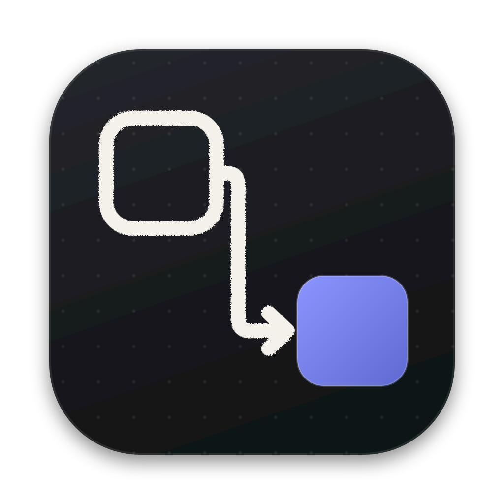
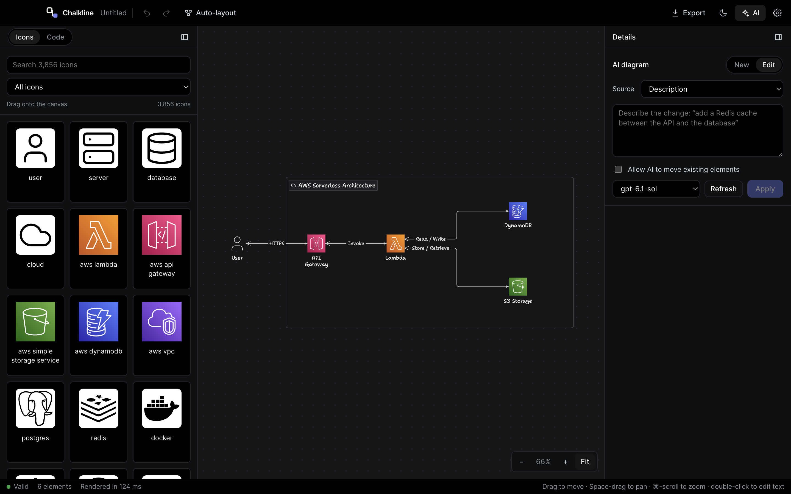

<p align="center">
  
</p>

<h1 align="center">Chalkline</h1>

<p align="center">
  Architecture diagrams from ideas, code and your own AI harness.
</p>

<p align="center">
  <a href="#download">Download</a> ·
  <a href="#features">Features</a> ·
  <a href="#supported-harnesses-and-providers">Harnesses</a> ·
  <a href="#getting-started">Get started</a> ·
  <a href="#roadmap">Roadmap</a> ·
  <a href="https://github.com/Nikhiladiga/chalkline/issues">Report an issue</a>
</p>



*AWS serverless demo: API Gateway invokes Lambda, which connects to DynamoDB and S3. The icon palette, canvas and AI panel share one workspace.*

Chalkline is a desktop application for creating and editing architecture diagrams. Describe a system, choose a code folder, or draw directly with service icons and connectors. Refine the result visually or in JSON, then export it for documentation and presentations.

Use an installed Codex or Claude Code CLI with its existing login, a local model through LM Studio, or an OpenAI-compatible API. You can also draw manually without configuring AI.

**Status:** beta. Download macOS (Apple Silicon and Intel) and Windows x64 builds from the [latest release](https://github.com/Nikhiladiga/chalkline/releases/latest). Website: https://nikhiladiga.github.io/chalkline

## Download

Get the latest macOS (Apple Silicon or Intel) or Windows build from [Releases](https://github.com/Nikhiladiga/chalkline/releases/latest).

Builds are not code-signed yet:

- **macOS:** open the app once, then go to System Settings → Privacy & Security and choose **Open Anyway**.
- **Windows:** in SmartScreen choose **More info** → **Run anyway**.

## Features

- Generate diagrams from natural-language descriptions and refine them with follow-up instructions.
- Turn a code folder into a runtime architecture overview, with source references and scan coverage details.
- Choose a supported installed harness, refresh available models, or connect a local/API provider.
- Search **3,856 icons** across AWS, Azure, Google Cloud and general service/brand categories; drag them onto the canvas.
- Connect icons through **eight connection ports**, with a live preview and target snapping.
- Move, resize, select, duplicate and delete elements; edit captions and drag elements into or out of groups.
- Switch between the icon palette and a JSON editor with schema-aware completion and validation.
- Use auto-layout, pan, zoom, Fit, and light or dark themes.
- Keep control of AI edits with position preservation, cancellation and one-step Undo.
- Save editable JSON diagrams and recover unsaved work, including unfinished code drafts.
- Export **PNG, SVG, HTML and measured JSON**; copy PNG to the clipboard. PNG supports 1×/2× resolution and transparent backgrounds.

## Supported harnesses and providers

| Integration | Authentication / requirements | Model selection |
| --- | --- | --- |
| **Codex CLI** | Installed CLI with a working saved login; no app API key required. | Dynamic catalog queried from the installed CLI, plus its built-in default. |
| **Claude Code CLI** | Installed CLI with a working saved login; no app API key required. | Supported aliases such as default, Sonnet, Opus and Haiku. |
| **LM Studio** | A loaded model and a running local API server. | Models returned by the configured server. |
| **OpenAI-compatible API** | Compatible base URL and API key when required. | Models returned by the endpoint, or a manually entered model ID. |

In **Settings**, choose **Local CLI (existing login)** and select an installed harness. Codex and Claude Code are the two supported harnesses today. Enter an executable path if automatic discovery cannot find your installation. Other installed CLIs are not yet integrated.

For LM Studio, the default server URL is `http://127.0.0.1:1234/v1`. For API providers, set the base URL and credentials in Settings. Select a model in the AI panel and use **Refresh** to reload its list.

An installed CLI uses its provider's model service; it does not necessarily run AI locally. CLI generation disables filesystem tools, plugins, MCP and project rules. Codex requires support for `--ignore-user-config` and `--ignore-rules`; personal model/provider configuration is not applied to generation.

## Getting started

### Run from source

Requirements: **Node.js 24** (22.18+ works) and **pnpm**. The current macOS build requires **macOS 13+**. An AI provider is optional for manual editing.

```sh
git clone https://github.com/Nikhiladiga/chalkline.git
cd chalkline
pnpm install
pnpm dev
```

Installation downloads Electron. `pnpm dev` opens Chalkline with hot reload.

### Create your first diagram

1. Configure your provider in **Settings**.
2. Open **AI → New**, choose **Description**, and select a model.
3. Enter a prompt and choose **Generate**.
4. Refine the result with **Edit**, drag icons onto the canvas, or switch to **Code**.
5. Save with `⌘/Ctrl+S` and export from the toolbar.

Try the demo shown above:

> Create an AWS serverless API diagram. A User sends HTTPS requests to API Gateway, which invokes Lambda. Lambda reads and writes DynamoDB records and stores files in S3. Arrange the request flow left to right, with DynamoDB and S3 on separate branches. Use AWS service icons, clear labels and generous spacing.

### Generate from a code folder

Choose **AI → New → Source → Code folder**, select a project or service directory, review scan coverage, and Generate. An optional focus such as `Trace API requests, database writes and indexing` helps narrow the overview.

The scanner reads source, manifests and configuration without executing the project. It prioritizes runtime evidence and groups route handlers, ORM models and SDK helpers into their owning service. The default is a runtime diagram; ask explicitly for an import/dependency graph when needed.

Use **Rescan** to refresh evidence or **Edit → Apply** to update the diagram after code changes. Existing positions are preserved by default. Select the source folder again after reopening the app. There is no background watcher today.

Large repositories use bounded excerpts, so scan coverage and model-authored source references should be reviewed. Oversized files and excluded paths are skipped, and the review step shows what was scanned.

### Draw and refine manually

In **Icons**, search or filter the catalog and drag an icon onto the canvas. Drag between connection ports to link services. Use **Details** to edit captions and properties, or **Code** for direct JSON editing with `Ctrl+Space` completion. Invalid code drafts must be fixed or discarded before saving.

Use **Auto-layout** to reorganize the diagram, **Space + drag** to pan, `⌘/Ctrl + scroll` to zoom, and **Fit** to frame it. AI edits preserve positions unless you enable **Allow AI to move existing elements**. Generation can be cancelled with **Stop**, and accepted changes can be undone.

Save diagrams as editable JSON. PNG is available at 1×/2× with optional transparency, plus SVG, HTML, measured JSON and PNG clipboard export. Current SVG exports use HTML/`foreignObject`; applications that do not support it may not display them correctly.

## Privacy and data handling

Diagram files and manual edits stay on your computer. Choosing or rescanning a folder does not call AI. **Generate** and **Apply** send prompts, diagram data and selected source excerpts to your configured provider.

The scanner respects nested `.gitignore` rules and skips dependencies, build output, symlinks, binaries, oversized files, credential files and agent instructions. Common literal secrets are redacted, but detection is best effort. Review confidential code before sending it to a provider. Generated diagrams can contain project details derived from that evidence.

API keys are stored with Electron's `safeStorage` and are not exposed to the renderer. Saved diagrams do not embed keys, settings, source-folder access or the full scan context. Settings, recovery data and cached icons use the legacy `diagrammer` application-data directory.

Uncached icons may require a hosted icon request. A local model endpoint and cached icons can avoid hosted AI and icon requests. Review AI-generated architecture against the source; valid JSON alone does not establish correctness.

## Roadmap

These are proposed priorities, not features available in the current release. Scope and timing may change.

### Near term

- [ ] Publish signed/notarized macOS releases and a Homebrew cask.
- [ ] Broaden testing of installers, harness execution and exports on Windows and Intel macOS, and add Linux builds.
- [ ] Improve code-folder architecture quality with larger real-project evaluations and clearer source evidence.
- [ ] Add starter diagrams for common cloud, API, database, search and queue architectures.

### Under consideration

- [ ] Reduce application size through a Tauri port, after proving native exports and rendering on each platform.
- [ ] Support additional CLI harnesses through the existing provider workflow.
- [ ] Preview code-driven diagram changes before applying them, with links from components to source evidence.
- [ ] Offer optional folder watching and refresh prompts when source changes.
- [ ] Add alignment guides, grid snapping and more control over connector routing.
- [ ] Produce native vector SVG exports for graphics tools that do not support `foreignObject`.

Suggest features or report problems through [GitHub issues](https://github.com/Nikhiladiga/chalkline/issues).

## Development

| Command | Purpose |
| --- | --- |
| `pnpm dev` | Start the desktop app with hot reload. |
| `pnpm build` | Build the main process, preload and renderer into `out/`. |
| `pnpm start` | Run the built app. |
| `pnpm check` | Run TypeScript, Biome and unit tests. |
| `pnpm test` | Run unit tests. |
| `pnpm test:e2e` | Build and run the Playwright Electron suite. |
| `pnpm eval:s3` | Run the S3 diagram evaluation. |

Live harness acceptance tests are opt-in and use the selected CLI's login and quota. Tests against your own code send selected excerpts to the provider.

The app uses Electron, React, TypeScript, Zustand, CodeMirror, ELK and the Eraser Diagrams packages.

## Desktop builds and distribution

| Command | Output |
| --- | --- |
| `pnpm dist:mac` | Local macOS DMG/ZIP with ad hoc signing. |
| `pnpm dist:win` | Windows NSIS installer target. |
| `pnpm dist:linux` | Linux AppImage target. |
| `pnpm release:mac` | Signed/notarized macOS release workflow, with release credentials configured. |
| `pnpm brew:prepare` | Prepare a Homebrew cask from a release archive; see CONTRIBUTING.md for arguments. |

Artifacts are written to `dist/`. A local ad hoc macOS build is not a notarized public release. Apple Silicon and Intel macOS and Windows x64 builds are published automatically and are early (beta, unsigned); please report issues. Linux is not published. Development is supported on macOS; the `dev`/`start` scripts use a POSIX `env` wrapper that Windows `cmd.exe` lacks.

Every push to `main` that changes app files (not only `site/`, Markdown or LICENSE) builds and publishes a GitHub Release with the next patch tag, including macOS (arm64, x64) and Windows builds; see [Releases](https://github.com/Nikhiladiga/chalkline/releases). These builds are unsigned. For signing, notarization and Homebrew cask preparation, see [CONTRIBUTING.md](CONTRIBUTING.md#signed-macos-release).

## Contributing

See [CONTRIBUTING.md](CONTRIBUTING.md) and [AGENTS.md](AGENTS.md).

## License and credits

MIT; see [LICENSE](LICENSE).

The rendering engine uses the MIT-licensed **Eraser Diagrams** packages; notices are in `third_party/eraser-diagrams`. The [upstream license](third_party/eraser-diagrams/LICENSE) and font notices are included in packaged resources. Service icons and logos remain their respective owners' marks.
